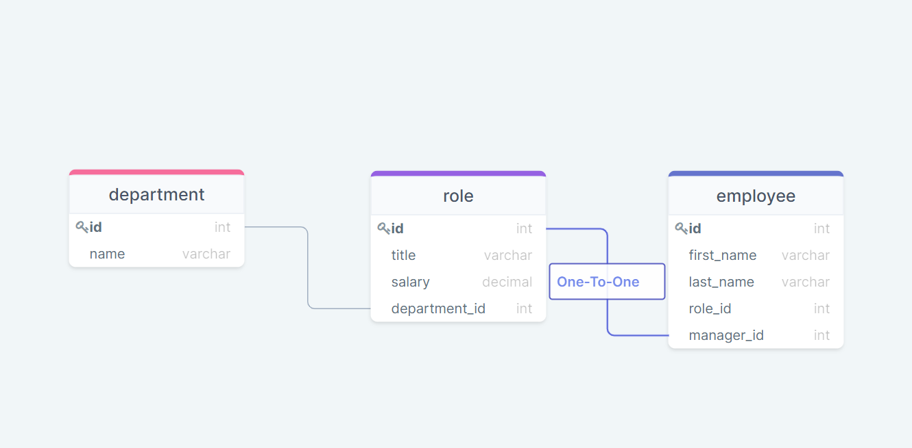
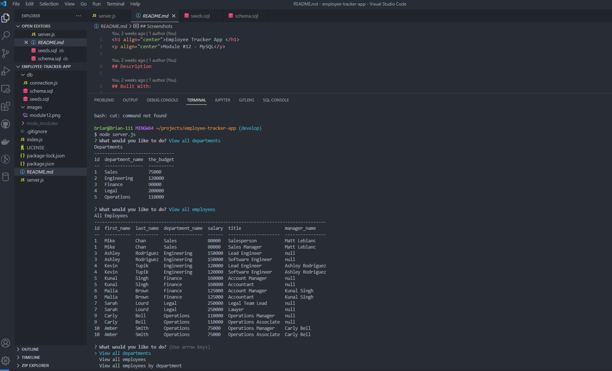
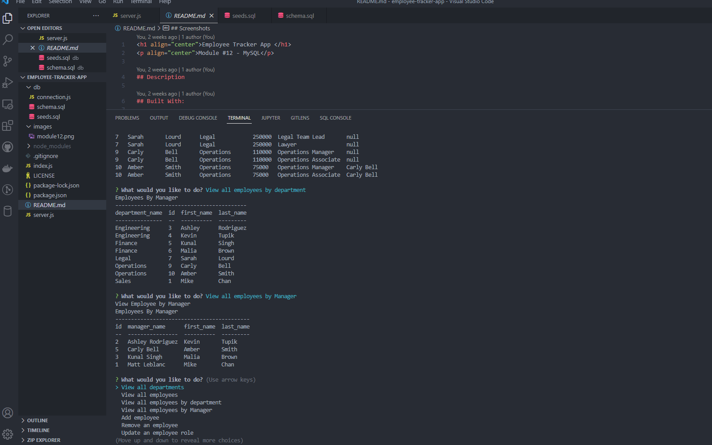
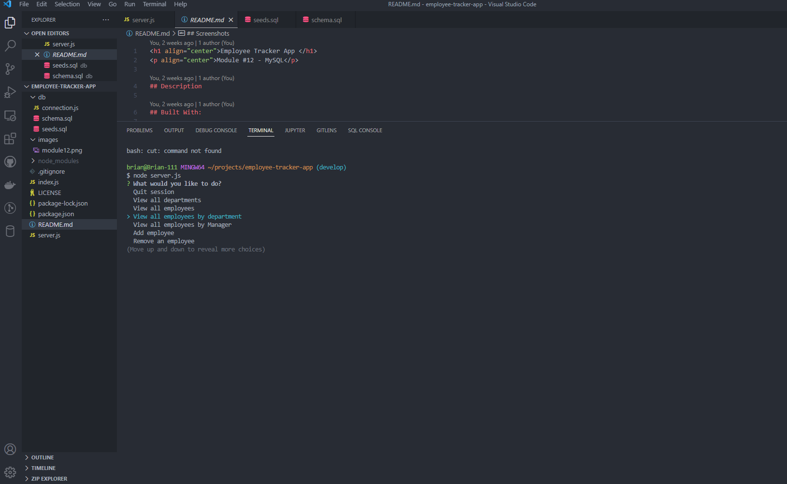

<h1 align="center">Employee Tracker</h1>

## Description
This commanmd-line application will allow an employer to add, update, create & delete (CRUD) functions to manage a company's employee database.
This application uses an SQL database that represents the departments, roles & employees of a company. 

## Technologies
* JavaScript
* Node.js
* NPM
* Inquirer
* MySQL

## Table of Contents

- [Installation](#installation)
- [Usage](#usage)
- [Screenshot](#screenshot)
- [License](#license)

## User Story
AS A business owner 
I WANT to be able to view and manage the departments, roles, and employees in my company 
SO THAT I can organize and plan my business

## Acceptance Criteria
GIVEN a command-line application that accepts user input 
WHEN I start the application 
THEN I am presented with the following options: view all departments, view all roles, view all employees, add a department, add a role, add an employee, and update an employee role 
WHEN I choose to view all departments 
THEN I am presented with a formatted table showing department names and department ids 
WHEN I choose to view all roles 
THEN I am presented with the job title, role id, the department that role belongs to, and the salary for that role 
WHEN I choose to view all employees 
THEN I am presented with a formatted table showing employee data, including employee ids, first names, last names, job titles, departments, salaries, and managers that the employees report to 
WHEN I choose to add a department 
THEN I am prompted to enter the name of the department and that department is added to the database 
WHEN I choose to add a role 
THEN I am prompted to enter the name, salary, and department for the role and that role is added to the database 
WHEN I choose to add an employee 
THEN I am prompted to enter the employee’s first name, last name, role, and manager, and that employee is added to the database 
WHEN I choose to update an employee role 
THEN I am prompted to select an employee to update and their new role and this information is updated in the database
## Installation
First clone the repository from GitHub. This application uses inquirer.js, mysql2 & console.table. Run npm install in the root directory to download these dependencies. To view database from MySQL run mysql -u root -p. Once in terminal run node server.js for the app to begin.

## Usage
View video walkthrough on how to use this application by clicking [here](https://drive.google.com/file/d/11HZ8qa3tvxgWWrt5KZ_fsqIlOxFyNHk5/view)

## Screenshots

## License
 
This project is licensed under the MIT License - see the [license info](https://opensource.org/licenses/MIT) for more details.